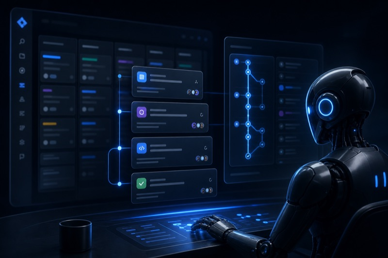
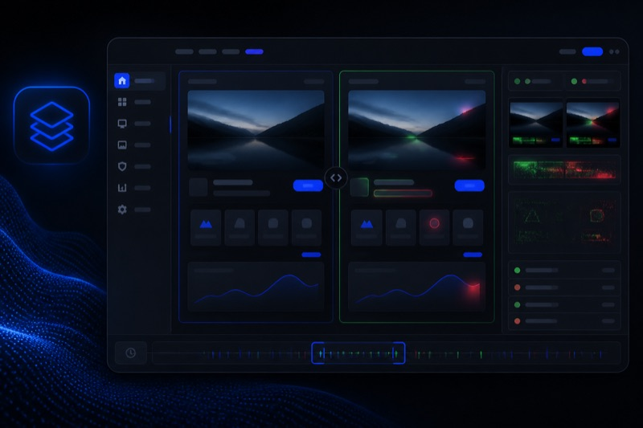
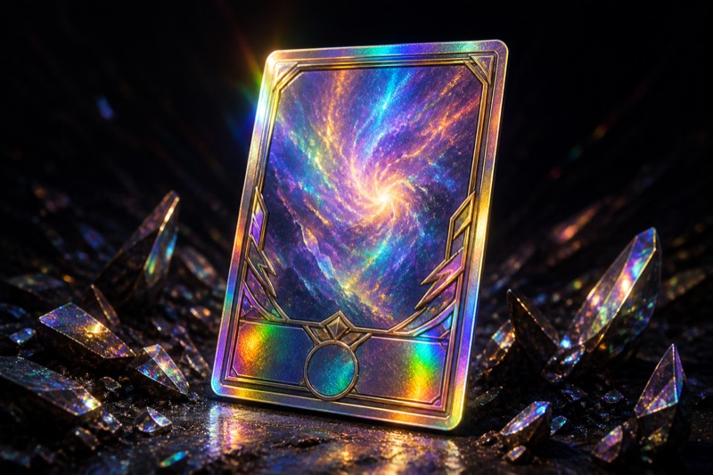
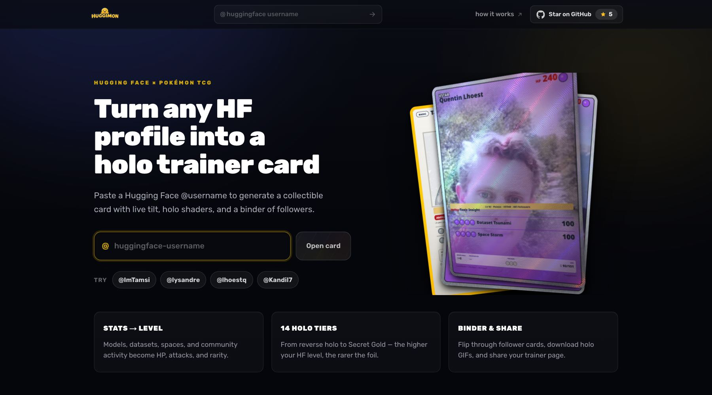
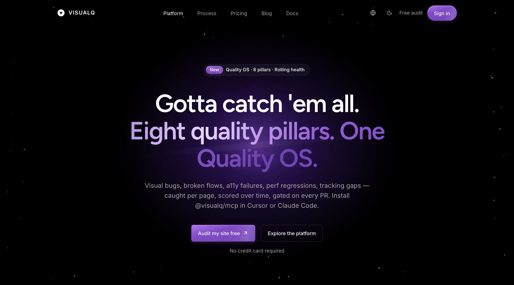
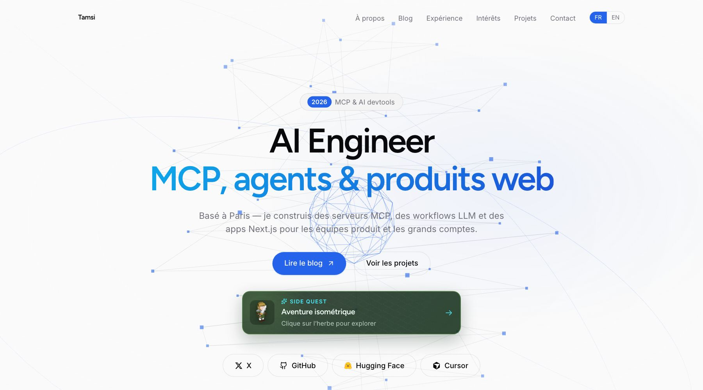
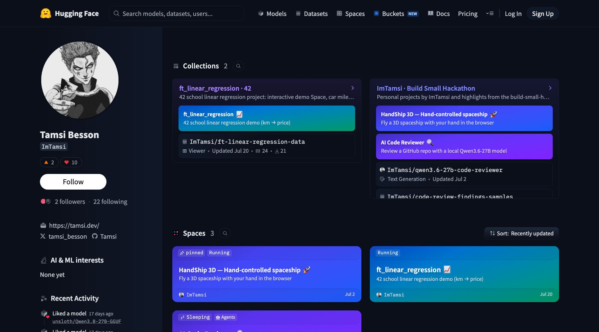
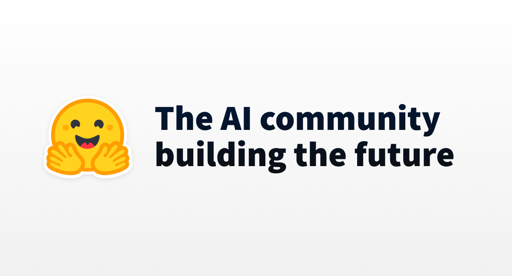

  

  <h1>Tamsi Besson</h1>

  

   

  
  
  
  

---

<table>
  <tr>
    <td width="38%" align="center" valign="top">
      
       
      <a href="https://huggimon.co/ImTamsi">huggimon.co/ImTamsi</a> · LV 24 · Cosmos Holo
    </td>
    <td valign="top">
       

      **AI developer in Paris** — I build **autonomous AI agents**, **MCP servers**, and **production SaaS** for media & enterprise teams.

      Full-stack @ [Livingcolor](https://www.livingcolor.fr) since 2018 — Drupal, Symfony, React/Next.js, React Native, Shopify, and AI integrations for TotalEnergies, France Télévisions, AFP, TV5Monde, and LVMH houses.

      **42** Digital Technologies Architect · AI Agents & MCP (Hugging Face) · ML Specialization (Stanford Online)
    </td>
  </tr>
</table>

---

## What I build

<table>
  <tr>
    <td width="50%" align="center" valign="top">
      
        
      <strong>AI agents</strong>
       
      <a href="https://github.com/abecms/livingcolor-plugin">livingcolor-plugin</a>
      ·
      <a href="https://github.com/Tamsi/livingcolor-skills">skills</a>
      ·
      <a href="https://github.com/Tamsi/livingcolor-evolution">evolution</a>
       
      Hermes plugin for Jira-gated delivery, portable versioned skills, and a curator that keeps them fresh from the web.
    </td>
    <td width="50%" align="center" valign="top">
      
        
      <strong>MCP &amp; devtools</strong>
       
      <a href="https://github.com/Tamsi/ai-code-reviewer-mcp">ai-code-reviewer-mcp</a>
      ·
      <a href="https://github.com/Tamsi/git-mentor">git-mentor</a>
      ·
      <a href="https://github.com/Tamsi/redbee-mcp">redbee-mcp</a>
      ·
      <a href="https://github.com/abecms/visualq-mcp">visualq-mcp</a>
       
      Bridges for code review, GitHub career coaching, Red Bee OTT, and VisualQ VRT — wired into Cursor &amp; Claude.
    </td>
  </tr>
  <tr>
    <td width="50%" align="center" valign="top">
      
        
      <strong>SaaS products</strong>
       
      <a href="https://visualq.ai">VisualQ</a>
      ·
      <a href="https://reelify-prodsite.vercel.app">Reelify</a>
      ·
      <a href="https://score-jam-ai.vercel.app">ScoreJamAi</a>
       
      Visual regression with anti-shift diffing, LLM demo videos from any URL, and AI-powered scoring forms.
    </td>
    <td width="50%" align="center" valign="top">
      
        
      <strong>Open source</strong>
       
      <a href="https://github.com/Tamsi/huggimon">huggimon</a>
      ·
      <a href="https://github.com/abecms/abecms">abecms</a>
      ·
      <a href="https://github.com/Tamsi/shopify-app-starter">shopify-app-starter</a>
       
      Pokémon-style HF trainer cards, an API-first headless CMS (180+ ⭐), and a Shopify embedded-app starter.
    </td>
  </tr>
</table>

---

## Featured

<table>
  <tr>
    <td width="50%" align="center" valign="top">
      
        
      <strong><a href="https://github.com/Tamsi/huggimon">HuggiMon</a></strong> · TypeScript
       
      Holo trainer card from any Hugging Face profile — 3D tilt, 14 foil tiers, follower binder. Live at <a href="https://huggimon.co">huggimon.co</a>.
    </td>
    <td width="50%" align="center" valign="top">
      
        
      <strong><a href="https://visualq.ai">VisualQ</a></strong> · Quality OS
       
      Eight quality pillars, VRT + FRT + tracking, gated on every PR. MCP: <a href="https://github.com/abecms/visualq-mcp">visualq-mcp</a>.
    </td>
  </tr>
  <tr>
    <td width="50%" align="center" valign="top">
      
        
      <strong><a href="https://tamsi.dev">tamsi.dev</a></strong> · Next.js
       
      Portfolio, blog, and a few side quests — isometric adventure included.
    </td>
    <td width="50%" align="center" valign="top">
      
        
      <strong><a href="https://huggingface.co/ImTamsi">Hugging Face</a></strong> · @ImTamsi
       
      Spaces, collections, and demos — HandShip, code-reviewer, local Qwen experiments.
    </td>
  </tr>
</table>

  
  
  
  

---

## Agent stack

<table>
  <tr>
    <td width="50%" align="center" valign="top">
      
       
      <strong>Hermes Agent</strong> → LivingColor plugin → Jira to PR/MR, human-gated
    </td>
    <td width="50%" align="center" valign="top">
      
       
      <strong>MCP</strong> → servers for Cursor, Claude, and custom tool bridges
    </td>
  </tr>
  <tr>
    <td width="50%" align="center" valign="top">
      
       
      <strong>Cursor / Claude</strong> → agentic IDE and cloud automations
    </td>
    <td width="50%" align="center" valign="top">
      
       
      <strong>Hugging Face</strong> → local models, Spaces, and trainer cards
    </td>
  </tr>
</table>

---

## GitHub

  
  
  
  

---

## Stack

  

  
  
  
  
  
  

---

## Connect

  
  
  
  
  
  

  Building agents that ship — with humans in the loop.

