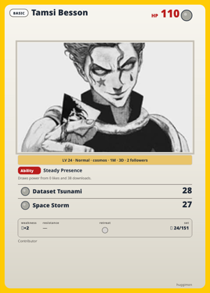
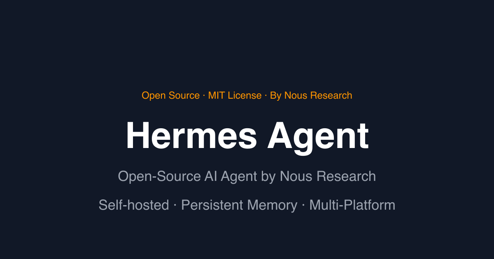
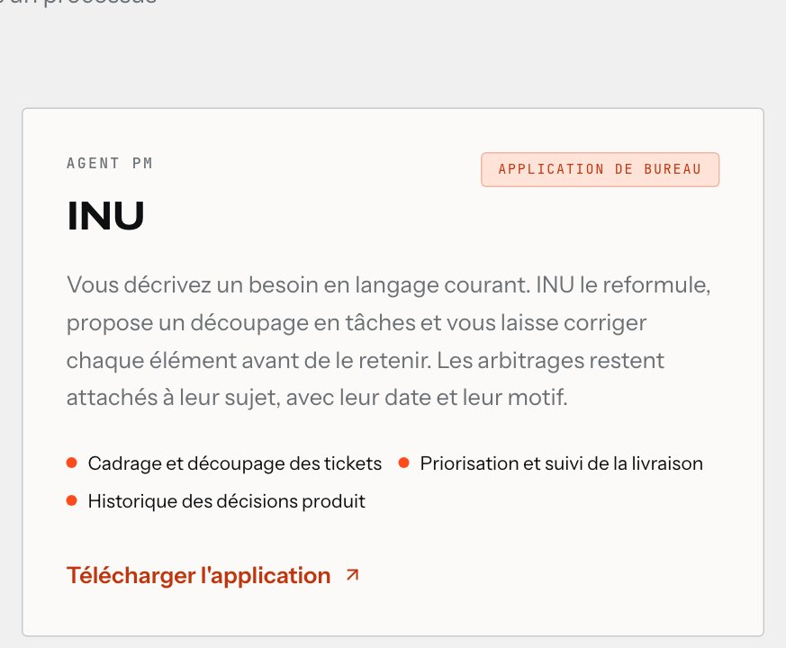
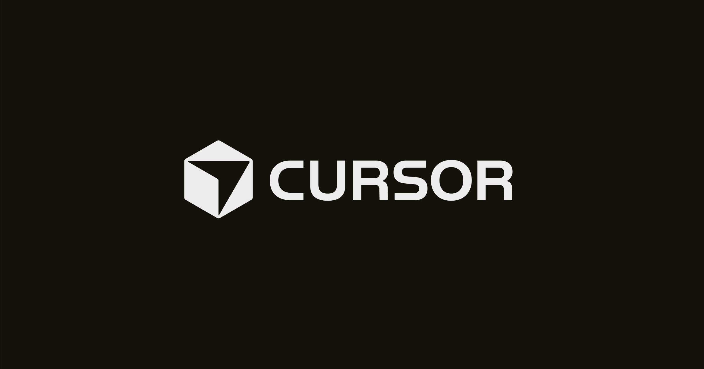

  

  <h1>Tamsi Besson</h1>

  

   

  
  
  
  

---

<table>
  <tr>
    <td width="38%" align="center" valign="top">
      
       
      <a href="https://huggimon.co/ImTamsi">huggimon.co/ImTamsi</a> · LV 24 · Cosmos Holo
    </td>
    <td valign="top">
       

      **AI developer in Paris** — I build **autonomous AI agents**, **MCP servers**, and **production SaaS** for media & enterprise teams.

      Full-stack @ [Livingcolor](https://www.livingcolor.fr) since 2018 — Drupal, Symfony, React/Next.js, React Native, Shopify, and AI integrations for TotalEnergies, France Télévisions, AFP, TV5Monde, and LVMH houses.

      **42** Digital Technologies Architect · AI Agents & MCP (Hugging Face) · ML Specialization (Stanford Online)
    </td>
  </tr>
</table>

---

## Agent stack

<table>
  <tr>
    <td width="33%" align="center" valign="top">
      
       
      <strong>Hermes Agent</strong> → LivingColor plugin → Jira to PR/MR, human-gated
    </td>
    <td width="33%" align="center" valign="top">
      
       
      <strong>INU</strong> · livingcolor.fr — desktop PM agent: scope tickets in plain language, keep decisions attached to the work
    </td>
    <td width="33%" align="center" valign="top">
      
       
      <strong>Cursor</strong> → agentic IDE, rules, skills, and cloud automations
    </td>
  </tr>
</table>

---

## GitHub

  
  

---

## Stack

  

  
  
  
  
  
  

---

## Connect

  
  
  
  
  
  

  Building agents that ship — with humans in the loop.

